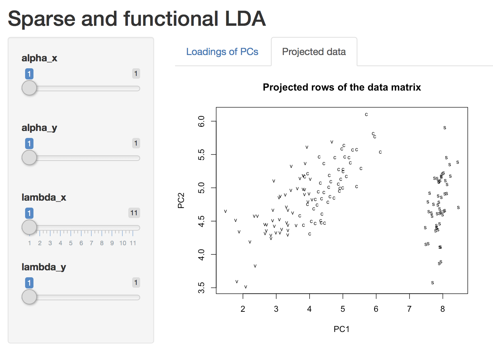

---
output:
  md_document:
    variant: gfm
---

<!--  -*- coding: utf-8 -*- -->
<!-- README.md is generated from README.Rmd. Do not edit this file directly -->

```{r, echo = FALSE}
knitr::opts_chunk$set(
    collapse = TRUE,
    comment = "#>",
    fig.path = "figs/"
)
```

# MoMA: Modern Multivariate Analysis

<!-- badges: start -->
[](https://travis-ci.com/DataSlingers/MoMA) 
[](https://codecov.io/gh/DataSlingers/MoMA/branch/develop)
[](https://www.gnu.org/licenses/old-licenses/gpl-2.0.en.html) [](https://cran.r-project.org/package=MoMA) 
[](http://www.repostatus.org/#wip)
<!-- badges: end -->

MoMA is a penalized SVD framework that supports a wide range of sparsity-inducing penalties. For a matrix _X_, MoMA gives the solution to the following optimization problem:

<center><br></center>

The penalties (the _P_ functions) we support so far include

* `moma_lasso()`: LASSO (least absolute shrinkage and selection operator).

* `moma_scad()`: SCAD (smoothly clipped absolute deviation).

* `moma_mcp()` MCP (minimax concave penalty).

* `moma_slope()`: SLOPE (sorted $\ell$-one penalized estimation).

* `moma_grplasso()`: Group LASSO.

* `moma_fusedlasso()`: Fused LASSO.

* `moma_spfusedlasso()`: Sparse fused LASSO.

* `moma_l1tf()`: $\ell$-one trend filtering.

* `moma_cluster()`: Cluster penalty.

With this at hand, we can easily extend classical multivariate models:

* `moma_sfpca()` performs penalized principal component analysis.

* `moma_sfcca()` performs penalized canonical component analysis.

* `moma_sflda()` performs penalized linear discriminant analysis.

We also provide Shiny App support to facilitate interaction with the results. If you are new to MoMA, the best place to start is `vignette("MoMA")`. 

## Installation

The newest version of the package can be installed from Github:

```{r, eval=FALSE}
library(devtools)
install_github("michaelweylandt/MoMA", ref = "build")
```

## Usage

Perform sparse linear discriminant analysis on the Iris data set.

```{r eval=FALSE}
library(MoMA)

## collect data
X <- iris[, 1:4]
Y_factor <- as.factor(rep(c("s", "c", "v"), rep(50, 3)))

## range of penalty
lambda <- seq(0, 1, 0.1)

## run!
a <- moma_sflda(
    X = X,
    Y_factor = Y_factor,
    x_sparse = moma_lasso(lambda = lambda),
    rank = 3
)

plot(a) # start a Shiny app and play with it!
```

<center>

</center>

## Background

Multivariate analysis -- the study of finding meaningful patterns in
datasets -- is a key technique in any data scientist's toolbox.
Beyond its use for Exploratory Data Analysis ("EDA"),
multivariate analysis also allows for principled *Data-Driven Discovery*:
finding meaningful, actionable, and reproducible structure in large data sets.
Classical techniques for multivariate analysis have proven immensely
successful through history, but modern Data-Driven Discovery requires
new techniques to account for the specific complexities of modern data.
This package provides a new unified framework for **Modern Multivariate Analysis** ("MoMA"),
which will provide a unified and flexible baseline for future research in multivariate
analysis. Even more importantly, we anticipate that this easy-to-use `R`
package will increase adoption of these powerful new models by end
users and, in conjunction with `R`'s rich graphics libraries, position
`R` as the leading platform for modern exploratory data analysis and
data-driven discovery.

Multivariate analysis techniques date back to the earliest days of statistics,
pre-dating other foundational concepts like hypothesis testing by several decades.
Classical techniques such as Principal Components Analysis ("PCA") [1, 2],
Partial Least Squares ("PLS"), Canonical Correlation Analysis ("CCA") [3],
and Linear Discriminant Analysis ("LDA"), have a long and distinguished
history of use in statistics and are still among the most widely used methods
for EDA. Their importance is reflected in the CRAN Task View dedicated to
Multivariate Analysis [4], as well as the specialized implementations available
for a range of application areas. Somewhat surprisingly, each of these techniques
can be interpreted as a variant of the well-studied eigendecomposition problem,
allowing statisticians to build upon a rich mathematical and computational literature.

In the early 2000s, researchers noted that naive extensions of
classical multivariate techniques to the high-dimensional setting
produced unsatisfactory results, a finding later confirmed by advances
in random matrix theory [5]. In response to these findings,
multivariate analysis experienced a renaissance as researchers
developed a wide array of new techniques to incorporate sparsity,
smoothness, and other structure into classical techniques
[6,7,8,9,10,11,12,13,14 among many others], resulting in a rich
literature on "modern multivariate analysis." Around the same time,
theoretical advances showed that these techniques avoided many of the
pitfalls associated with naive extensions [15,16,17,18,19,20].

While this literature is vast, it relies on a single basic principle: it is essential
to adapt classical techniques to account for known characteristics and complexities
of the dataset at hand for multivariate analysis to succeed. For example, a neuroscientist
investigating the brain's response to an external stimulus may expect a response
which is simultaneously spatially smooth and sparse: spatially smooth because the
brain processes related stimuli in well-localized areas (*e.g.*, the visual cortex)
and sparse because not all regions of the brain are used to respond to a given
stimulus. Alternatively, a statistical factor model used to understand financial
returns may be significantly improved by incorporating known industry sector data,
motivating a form of group sparsity. A sociologist studying how pollution leads
to higher levels of respiratory illnesses may combine spatial smoothness and
sparsity (indicating "pockets" of activity) with a non-negativity
constraint, knowing that pollution and illness have a positive effect.

To incorporate these different forms of prior knowledge into multivariate analysis,
a wide variety of algorithms and approaches have been proposed. In 2013, Allen
proposed a general framework that unified existing techniques for "modern" PCA,
as well as proposing a number of novel extensions [21]. The recently developed
`MoMA` algorithm builds on this work, allowing more forms of regularization
and structure, as well as supporting more forms of multivariate analysis.

The principal aim of this package is to make modern multivariate
analysis available to a wide audience. This package will allow
for fitting PCA, PLS, CCA, and LDA with all of the
modern "bells-and-whistles:" sparsity, smoothness, ordered and
unordered fusion, orthogonalization with respect to arbitrary bases,
and non-negativity constraints. Uniting this wide literature under a
single umbrella using the `MoMA` algorithm will provide
a unified and flexible platform for data-driven discovery in `R`.

## Authors

* [Michael Weylandt](http://github.com/michaelweylandt)

    Department of Statistics, Rice University

* [Genevera Allen](http://www.stat.rice.edu/~gallen)

    Departments of Statistics, CS,and ECE, Rice University

    Jan and Dan Duncan Neurological Research Institute
    Baylor College of Medicine and Texas Children's Hospital

* [Luofeng "Luke" Liao](http://github.com/Banana1530)

    School of Data Science, Fudan University

## Acknowledgements

* MW was funded by an NSF Graduate Research Fellowship 1450681.
* LL was funded by Google Summer of Code 2019.

## References

[1] K. Pearson. "On Lines and Planes of Closest Fit to Systems of Points in Space."
The London, Edinburgh, and Dublin Philosophical Magazine and Journal of Science
2, p.559-572, 1901. <https://doi.org/10.1080/14786440109462720>

[2] H. Hotelling. Analysis of a Complex of Statistical Variables into Principal
Components. Journal of Educational Psychology 24(6), p.417-441, 1933.
<http://dx.doi.org/10.1037/h0071325>

[3] H. Hotelling. "Relations Between Two Sets of Variates" Biometrika 28(3-4),
p.321-377, 1936. <https://doi.org/10.1093/biomet/28.3-4.321>

[4] See [CRAN Task View: Multivariate Statistics](https://cran.r-project.org/web/views/Multivariate.html)

[5] I. Johnstone, A. Lu. "On Consistency and Sparsity for Principal Components
Analysis in High Dimensions." Journal of the American Statistical Association:
Theory and Methods 104(486), p.682-693, 2009. <https://doi.org/10.1198/jasa.2009.0121>

[6] B. Silverman. "Smoothed Functional Frincipal Fomponents Analysis by Choice
of Norm." Annals of Statistics 24(1), p.1-24, 1996. <https://projecteuclid.org/euclid.aos/1033066196>

[7] J. Huang, H. Shen, A. Buja. "Functional Principal Components Analysis via
Penalized Rank One Approximation." Electronic Journal of Statistics 2, p.678-695,
2008. <https://projecteuclid.org/euclid.ejs/1217450800>

[8] I.T. Jolliffe, N.T. Trendafilov, M. Uddin. "A Modified Principal Component
Technique Based on the Lasso." Journal of Computational and Graphical Statistics
12(3), p.531-547, 2003. <https://doi.org/10.1198/1061860032148>

[9] H. Zou, and T. Hastie, and R. Tibshirani. "Sparse Principal Component Analysis."
Journal of Computational and Graphical Statistics 15(2), p.265-286, 2006.
<https://doi.org/10.1198/106186006X113430>

[10] A. d'Aspremont, L. El Gahoui, M.I. Jordan, G.R.G. Lanckriet. "A Direct Formulation
for Sparse PCA Using Semidefinite Programming." SIAM Review 49(3), p.434-448, 2007.
<https://doi.org/10.1137/050645506>

[11] A. d'Aspremont, F. Bach, L. El Gahoui. "Optimal Solutions for Sparse Principal
Component Analysis." Journal of Machine Learning Research 9, p.1269-1294, 2008.
<http://www.jmlr.org/papers/v9/aspremont08a.htm>

[12] D. Witten, R. Tibshirani, T. Hastie. "A Penalized Matrix Decomposition, with
Applications to Sparse Principal Components and Canonical Correlation Analysis."
Biostatistics 10(3), p.515-534, 2009. <https://doi.org/10.1093/biostatistics/kxp008>

[13] R. Jenatton, G. Obozinski. F. Bach. "Structured Sparse Principal Component
Analysis." Proceedings of the 13th International Conference on Artificial
Intelligence and Statistics (AISTATS) 2010. <http://proceedings.mlr.press/v9/jenatton10a.html>

[14] G.I. Allen, M. Maletic-Savatic. "Sparse Non-Negative Generalized PCA with Applications
to Metabolomics." Bioinformatics 27(21), p.3029-3035, 2011. <https://doi.org/10.1093/bioinformatics/btr522>

[15] A.A. Amini, M.J. Wainwright. "High-Dimensional Analysis of Semidefinite Relaxations
for Sparse Principal Components." Annals of Statistics 37(5B), p.2877-2921, 2009.
<https://projecteuclid.org/euclid.aos/1247836672>

[16] S. Jung, J.S. Marron. "PCA Consistency in High-Dimension, Low Sample Size
Context." Annals of Statistics 37(6B), p.4104-4130, 2009. <https://projecteuclid.org/euclid.aos/1256303538>

[17] Z. Ma. "Sparse Principal Component Analysis and Iterative Thresholding."
Annals of Statistics 41(2), p.772-801, 2013. <https://projecteuclid.org/euclid.aos/1368018173>

[18] T.T. Cai, Z. Ma, Y. Wu. "Sparse PCA: Optimal Rates and Adaptive Estimation."
Annals of Statistics 41(6), p.3074-3110, 2013. <https://projecteuclid.org/euclid.aos/1388545679>

[19] V.Q. Vu, J. Lei. "Minimax Sparse Principal Subspace Estimation in High Dimensions."
Annals of Statistics 41(6), p.2905-2947, 2013. <https://projecteuclid.org/euclid.aos/1388545673>

[20] D. Shen, H. Shen, J.S. Marron. "Consistency of Sparse PCA in High Dimension,
Low Sample Size Contexts." Journal of Multivariate Analysis 115, p.317-333, 2013.
<https://doi.org/10.1016/j.jmva.2012.10.007>

[21] G.I. Allen. "Sparse and Functional Principal Components Analysis." ArXiv
Pre-Print 1309.2895 (2013). <https://arxiv.org/abs/1309.2895>
